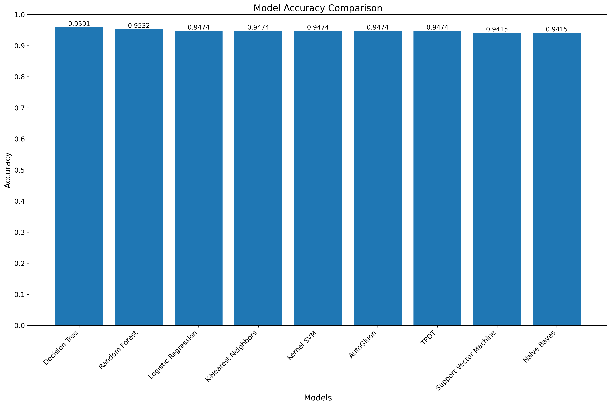
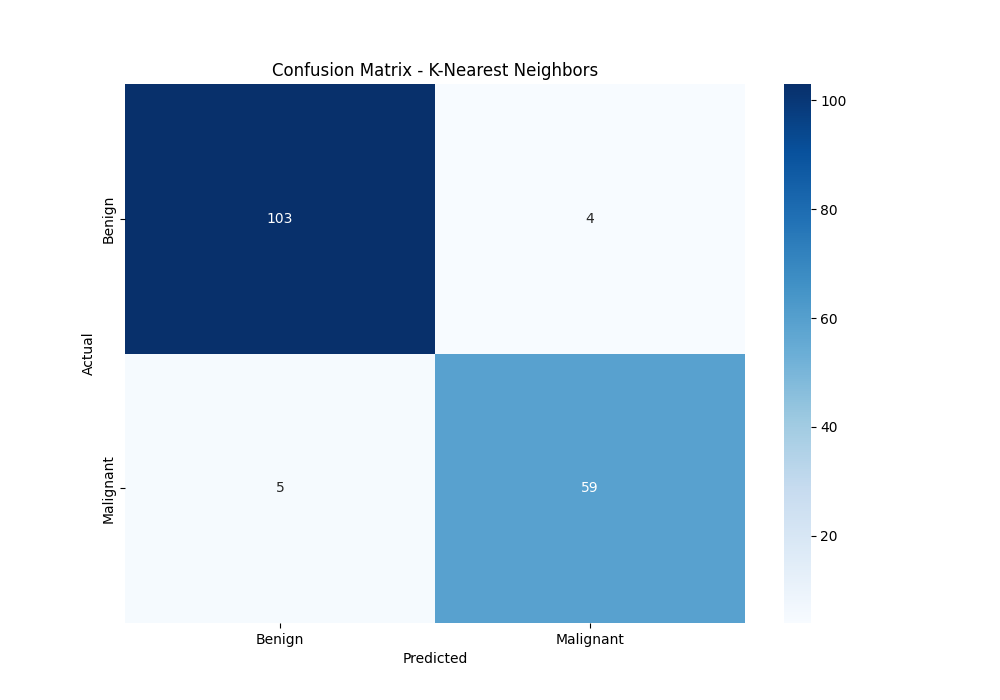
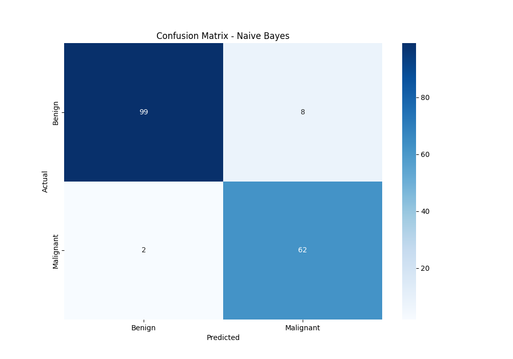
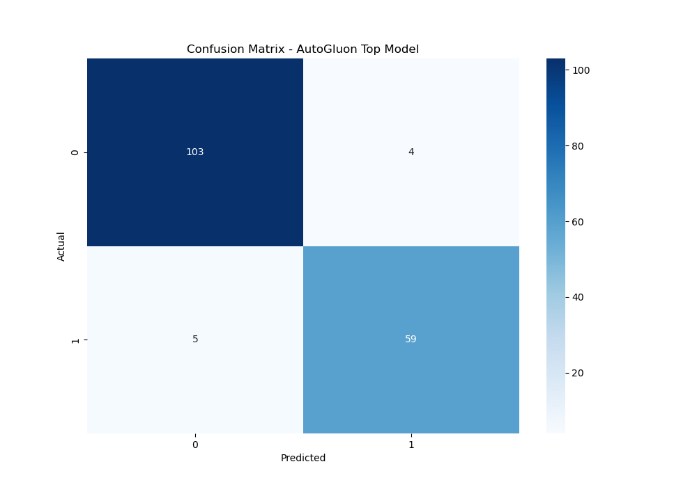

# Breast Cancer Classification

## Problem Description

This project focuses on the classification of breast cancer tumors as either benign (2) or malignant (4) based on various features extracted from digitized images of fine needle aspirates (FNA) of breast masses. Early and accurate diagnosis of breast cancer is crucial for effective treatment and improved patient outcomes.

## Dataset

The dataset used in this project is the Breast Cancer Wisconsin (Diagnostic) Data Set. It includes features computed from a digitized image of a fine needle aspirate (FNA) of a breast mass. The features describe characteristics of the cell nuclei present in the image.

### Features:

1. Clump Thickness
2. Uniformity of Cell Size
3. Uniformity of Cell Shape
4. Marginal Adhesion
5. Single Epithelial Cell Size
6. Bare Nuclei
7. Bland Chromatin
8. Normal Nucleoli
9. Mitoses

The target variable is the diagnosis: 2 for benign and 4 for malignant.

## Model Comparison

We implemented and compared several machine learning models to classify breast cancer tumors. Here are the results:

| Model                  | Accuracy |
|------------------------|----------|
| Logistic Regression    | 0.9474   |
| K-Nearest Neighbors    | 0.9474   |
| Support Vector Machine | 0.9415   |
| Kernel SVM             | 0.9474   |
| Naive Bayes            | 0.9415   |
| Decision Tree          | 0.9591   |
| Random Forest          | 0.9532   |
| AutoGluon              | 0.9474   |
| TPOT                   | 0.9474   |

## Model Performance Visualization



## Confusion Matrices

<table>
  <tr>
    <th>Logistic Regression</th>
    <th>K-Nearest Neighbors</th>
  </tr>
  <tr>
    <td></td>
    <td></td>
  </tr>
  <tr>
    <th>Support Vector Machine</th>
    <th>Kernel SVM</th>
  </tr>
  <tr>
    <td></td>
    <td></td>
  </tr>
  <tr>
    <th>Naive Bayes</th>
    <th>Decision Tree</th>
  </tr>
  <tr>
    <td></td>
    <td></td>
  </tr>
  <tr>
    <th>Random Forest</th>
    <th>AutoGluon</th>
  </tr>
  <tr>
    <td></td>
    <td></td>
  </tr>
  <tr>
    <th>TPOT</th>
    <th></th>
  </tr>
  <tr>
    <td></td>
    <td></td>
  </tr>
</table>

## AutoML Results

### AutoGluon

AutoGluon's best model achieved an accuracy of 0.9474 on the test set. The top-performing models in AutoGluon's leaderboard were:

1. LightGBMXT
2. CatBoost
3. LightGBMLarge
4. LightGBM
5. XGBoost

All of these models achieved the same validation accuracy of 0.970874.

### TPOT

TPOT's best model also achieved an accuracy of 0.9474 on the test set. The best pipeline found by TPOT was:

```python
ExtraTreesClassifier(ZeroCount(input_matrix), bootstrap=True, criterion=entropy, max_features=0.4, min_samples_leaf=15, min_samples_split=17, n_estimators=100)
```

## Conclusion

All models performed well on this dataset, with accuracies ranging from 94.15% to 95.91%. The Decision Tree classifier achieved the highest accuracy at 95.91%, closely followed by Random Forest at 95.32%. 

The AutoML tools (AutoGluon and TPOT) performed on par with the best manually implemented models, both achieving 94.74% accuracy. This demonstrates the effectiveness of automated machine learning approaches in finding competitive models with minimal human intervention.

It's important to note that while these results are promising, further validation (such as cross-validation) and possibly hyperparameter tuning could be performed to ensure the models' generalizability. Additionally, given the critical nature of cancer diagnosis, it's crucial to consider not just overall accuracy, but also the balance between sensitivity (recall for malignant cases) and specificity (recall for benign cases).

